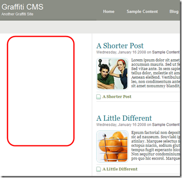
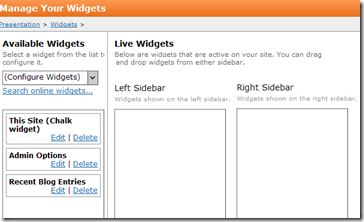
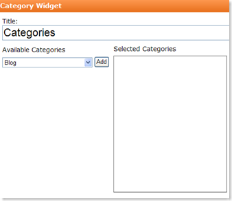
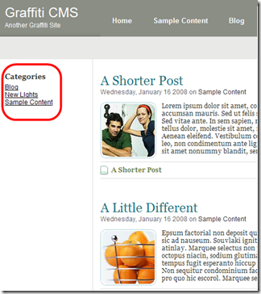

# Adding a Widget
Click here to learn more about widgets. Refer to Building a Widget for information about building a widget.

The following procedure shows how you can place a widget on a web page. The procedure will place the widget in the left sidebar, as shown below.

: 

The theme shown above only supports a single sidebar in the leftcolumn; however, you can easily place them in the right column or even use both columns. It is up to the theme designer to make this decision.

_**Procedure**_

1. Navigate to Control Panel > Presentation > Widgets. The Manage Your Widgets page displays. 

: 

The page has 2 panels. The first contains a list of available widgets and a list of widgets which are selected but not yet added to a sidebar. A nice feature of this holding-pattern approach is that it gives you a convenient way to make any settings changes to a widget before placing it on your site. The right panel contains the left sidebar and right sidebar widget list.

2.To edit the widget, click Edit. A window opens with the editing options. 

: 

3.After you make your edits, click Update. Graffiti returns you to the Manage Your Widgets page. 

4.Drag the widgets from the holding area to the left sidebar column. The widget displays in the left column of your Web site.

: 

_If you need to make a change later, you can remove, delete, or rearrange a widget, or even put it back in the holding area._