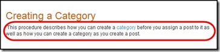
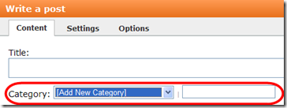
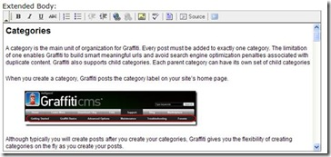

# Adding a Post Excerpt
A post excerpt is a brief textual description of the post’s content. Graffiti will use part of the post’s body content as the excerpt if you do not specify the excerpt content. 

The following example shows a post excerpt:

: 

Whether or not your site uses excerpts is determined by the theme's designer. However the rules below are Graffiti's recommended approach and the ones Graffiti uses with all its themes.

* The content entered in the Body field will be used as the excerpt. For those using a tool like [Windows Live Writer](Windows-Live-Writer-Application), Body is the part defined about the "Split Post" line. 
* Graffiti will take your post content, strip out all of the HTML and then use the first N characters of the content as the excerpt. N is defined as the value from the last parameter in the following [Chalk](Chalk-Overview) method:

{code:html}
$post.Excerpt("
Continue reading <em>&quot;", "&quot;</em>
" ,$post.Title, 300)
{code:html}
In this case, the value of N is 300 characters. Graffiti truncates the post at the first space after the N value. This stops Graffiti from truncating mid-word.

The link is always displayed if an Extended Body exists because the Extended Body is never used as part of the Excerpt. The link is not displayed if there is not an Extended Body and the Excerpt Length N is large enough to include the entire Post Body. If you do not want the link to appear under any circumstances, specify null in place of $post.Title in the example above.

_**Note:** Often when truncating excerpt content, users set the link text to "Read More" or something similar. This can detract from your site’s search engine optimization because it gives weight (via links) to meaningless text. It is a much better approach to set this value to your post title._

_**Procedure**_

You can specify the excerpt content from the post content. The following procedure assumes you understand how to create a post and understand the post settings. If you need help creating your post, refer to [Setting Post Content](Setting-Post-Content).

1. Enter the post excerpt content in the **Body** text panel. The content in the **Body** text panel will be used as your post excerpt. 

: 

2. Click **extended body** to open the extended body text panel.

3. Type your remaining text in the extended body text panel.  

: 

4. Click Publish to publish the post content. 