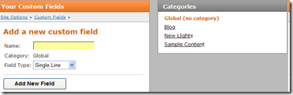
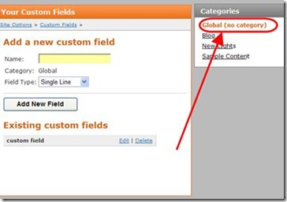
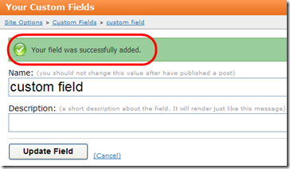
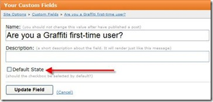

# Adding Custom Fields
While Graffiti [post](Post) feature supports the most common post-content needs, there will be times when you or a client requires additional field options to build your site. Graffiti's custom field functionality allows you to add custom fields to your site.

Custom fields are not accessible to visitors to your site until you edit the site theme to include the custom fields. It is simple for most Graffiti users to define custom field properties and post a custom field. However, adding the custom field to the theme requires you to have more advanced knowledge of web-site development and should probably be left to a developer.

_**Procedure**_

1. Navigate to **Control Panel > Site-Options > Custom Fields**. The first time you view the custom fields page the form looks like this.

: 

2. Select the category to which you want the custom field added.

: 

When you assign a custom field to a category, all posts assigned to the category will have the custom field available. You can then navigate to the post’s Custom Fields tab and enable the custom field. 

By default, when you add a new custom field, it is assigned to Global unless you assign it to a category. 

3. Specify the custom field properties. 
 
|| Field || Description || Options ||
| **Name** | Name of the field. Used later to retrieve custom values and as a label on the form. It will also be used in the theme. | n/a |
| **Category** | Specifies the category to which the customer field is added | **Global** – shared custom fields across all categories. **List of categories** – includes the list of all categories you have created |
| **Field Type** | ecifies the generic field type | **Single Line** – a single line textbox, **Multiple Lines** – a multi-line textbox, **List** – drop-down list, **Checkbox**, **File Selector** – enables you to select a file from the /files directory to create a link to the file |

4. **Click Add New Field**. Graffiti indicates that you successfully added the custom field.  

: 

The **Description** field is optional.

If your custom field is a checkbox, Graffiti includes an additional option: **Default State**. 

: 

The default state option allows you to specify the default state of the checkbox you just added. If checked, the checkbox will be checked by default. 

5. Click **Update Field** to return to the Add a new custom field window. Graffiti displays the new field and any other fields you have created below the custom field form.