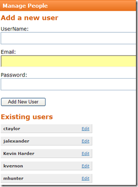
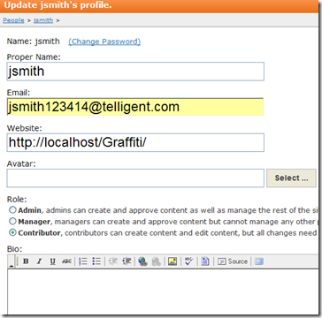

# Assigning User Roles
A system administrator can control user privileges for your Web site.

To control user privileges for your site development and maintenance, Graffiti supports three predefined roles:

||User Role||Description||
|Admin|Has all user privileges, including Publishing content, Approving content, Adding categories, Managing users, Editing themes and widgets|
|Manager|Can publish content without approval as well as approve other users’ content.|
|Contributor|Can create new posts as well as edit existing posts. However, contributor content cannot be published to the public without first being approved by a manager or admin. When a contributor makes a change requiring approval, Graffiti notifies admins and managers via email.|

Only Admins have permission to assign user roles, so users with Manager and Contributor role assignments will not have access to People on the navigation bar.

_**Procedure**_

1. Navigate to Control Panel > People. The Manage People page displays.

: 

_**Note:** that all existing users are listed below the user data. You can edit existing users by clicking on the **Edit** link to the right of the user name._

2. Specify the user information in the data fields.

3. Click **Add New User**. Graffiti indicates that you have successfully created the new user and allows you to add user profile information. 

: 

4. Specify the user role by selecting the appropriate radio button. The Graffiti default setting is Contributor. The Avatar option and Bio information are optional. 

5. Click **Save**. The new user is added to the user list on the Manage People page. 