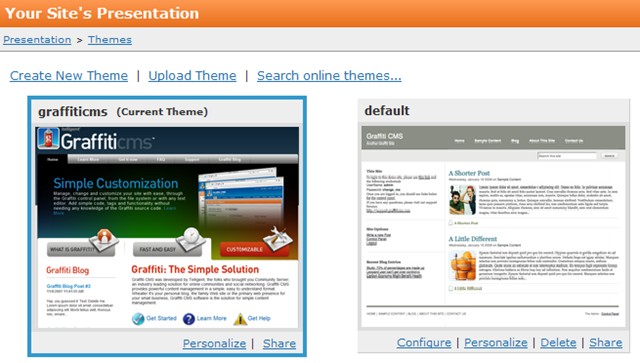

# Assigning a Theme
Graffiti makes it very easy for you to assign a theme to your Web site, whether it is a theme you have created or modified, or one of the default themes provided with Graffiti.

1. From the navigation bar, navigate to **Presentation>Themes**. The Your Site’s Presentation page displays. 

: 

Graffiti shows you the theme currently applied to your Web site (graffiticms in the example above). When you install the Graffiti package, Graffiti assigns the default theme to your Web site.

2. Click the theme you want to assign to your Web site. 

3. Refresh your Web site to see your web pages with the newly assigned theme.