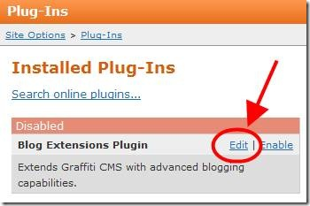
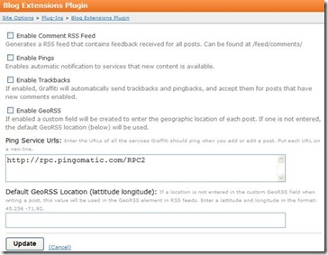

# Blogging Extensions Plug-In
The Blogging Extensions plug-in enhances Graffiti by supporting the following blogging capabilities: 
* **Trackbacks** – Trackbacks are automatically sent and received, providing visibility for users who are linking to your content. You receive acknowledgement that users have posted your content. 
* **Geo RSS** – Tags your posts with location information so users know from where content originates. 
* **Comments RSS Feeds** – Users can subscribe to comments on your site. 
* **Pings** – Graffiti sends out pings whenever new content is posted on your site. 
Click **Edit** to specify the Blogging Extensions plug-in settings. 

: 

The Blog Extensions page displays. 

: 