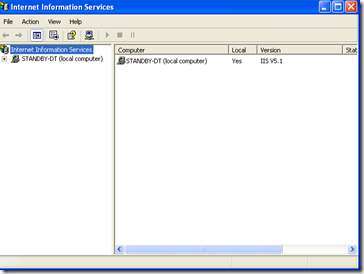
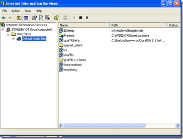
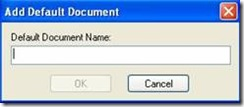
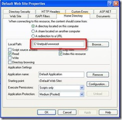

# Configuring Internet Information Services for Graffiti
Learn how to configure IIS to support Graffiti.

If your Web site is hosted by your local server, IIS is not required for Graffiti.

_**Procedure**_

1. Access IIS from Start/Settings/Control Panel/Administrative Tools/Internet Information Services. The Internet Information Services window displays. 

: 

2. In the left panel, navigate to the Default Web Site folder. 

: 

3. Right-click on the folder and select Properties to display the Default Web Site Properties window.

4. On the Documents tab, click **Add**. The Add Default Document window displays. 

: 

5.Type _default.aspx_ in the text field.

6.Click **OK**.

7.Click **Apply** on the Documents tab to save the setting.

8.On the Home Directory tab, ensure the local path is correct. 

: 

9. If you have not saved your settings, click **Apply** on the Default Web Site Properties window, then close out by clicking **OK**. You will return to the Internet Information Services window.

10. In the left panel, navigate to Web Sites/Default Web Sites/Graffiti (or the folder you specified during installation.

11. Right click on the Graffiti folder and select Properties to display the properties window.

12. From the Directory tab, click **Create**. The Application Name text field automatically populates and the **Create** button changes to **Remove**.

13. Go to Start/Run and type the following path to register ASPNET: _{"C:\WINDOWS\Microsoft.NET\Framework\v2.0.50727\aspnet_regiis.exe –i."}_

_Your system automatically opens a DOS command window. When registration is complete, the DOS command window closes automatically._