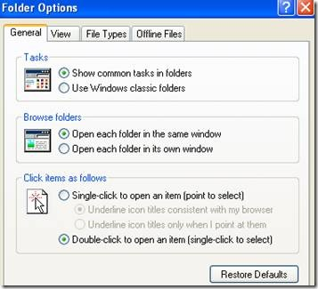
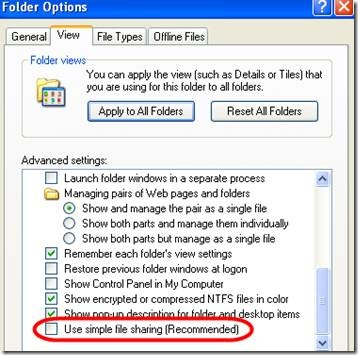
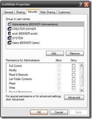
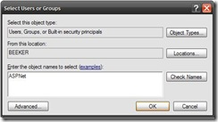
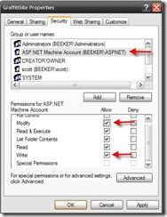
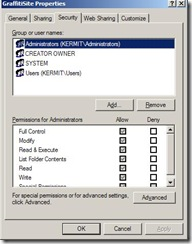
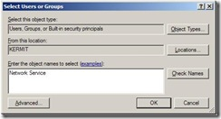
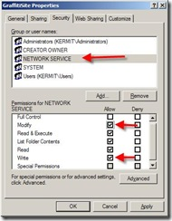
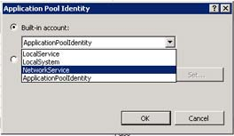
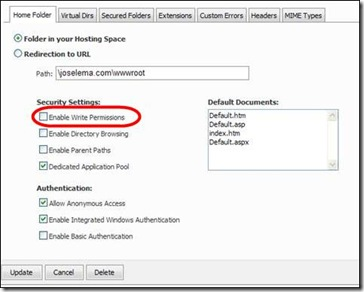

# Configuring Server Permissions for Graffiti
For Graffiti to function properly, you must enable Graffiti with full write access to your entire web directory. The configuration procedure you follow depends upon your operating system or server environment.

The following table describes the configuration options:

||OS or Server Type||Required OS or Server Environment||
|Local|Users of Windows XP Pro or Windows 2000 Pro (or Server)|
|Server|Users of Windows Server 2003 or Vista|
|Hosted|Users who are going to run Graffiti on a shared hosting environment (without direct access to the server)|

## Local

1. If you are using Windows XP, you must modify your folder options to enable access to permissions settings. By default, Windows XP does not show the security settings. 

   If you are not using Windows XP, continue at Step 2. 

   If you are using Windows XP, do the following:
 
: _A. Open a Windows Explorer window._

: _B. From the Explorer main menu, select Tools/Folder Options. The Folder Options modal window displays._

: 

: _C. Select the View tab._

: _D. Scroll to the bottom of the Advanced Settings panel._

: _E. Uncheck the Use simple file sharing checkbox._

: 

: _F. Click Apply._

: _G. Click OK to close the modal window._

2. Right-click on the folder containing your Graffiti files. 

3. Select Properties from the menu. The GraffitiSite Properties modal window displays. 

4. Select the Security tab. By default, Windows XP does NOT display the security tab. To see the Properties tab, select the Tools menu from any explorer window, navigate to the _"View"_ tab, scroll to the bottom and uncheck the option _"Use Simple File Sharing"_. 
The Properties tab window looks like this:

: 

5. Click **Add…** to display the Select Users or Groups window.

: 

6. Type ASPNET in the text box. 

7. Click **Check Names** to add the name of your computer in front of ASPNet. 

8. Click **OK** to return to the Properties tab. 

9. Select the ASPNET user account from the group or user names list. 

10. Check the following boxes under Allow in the Permissions for ASP.NET Machine Account list: 
* Modify
* Write  
: 

11. Click **Apply**. 

12. Click OK to close the Properties window. 

## Server
Setting up Windows 2003/2008 is exactly the same as setting up Windows XP with the exception that the user account is called Network Service rather than ASPNet.

1. Right-click on the folder containing your Graffiti files. 

2. Select Properties from the menu. 

3. Select the Security tab. The GraffitiSite Properties modal window displays. Click **Edit** if using Windows 2008.

: 

4. Click **Add…** to display the Select Users or Groups window. 

: 

5. Type Network Service in the text box. 

6. Click **Check Names** to add the name of your computer in front of ASPNet. 

7. Click **OK** to return to the Properties tab. 

8. Select the ASPNET user account from the group or user names list. 

9. Check the following boxes under Allow in the Permissions for Network Service list: 
* Modify 
* Write 
: 

10. Click **Apply**. 

11. Click **OK** to close the Properties window. 

_**Note:** When running IIS7, an additional step is required to grant permissions to the application pool._

12. IIS7 Only: Change the application pool default identity to Network Service so that permissions granted to the account are accessible from that application pool. Click the App Pool>Advanced Settings>Identity>select **Network Service**.

: 

_**Note:** For greater security under IIS7, permissions can be applied to the ApplicationPoolIdentity instead of the Network Service. [See details here](http://learn.iis.net/page.aspx/624/application-pool-identities/) for this slightly more complicated method._

## Hosted
Navigate to folder where you uploaded the Graffiti files and select the option which enables write access.

: 

The window displayed by the system may look slightly different depending on where your site is hosted, but but the options will be very similar.