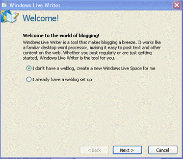
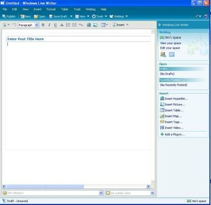
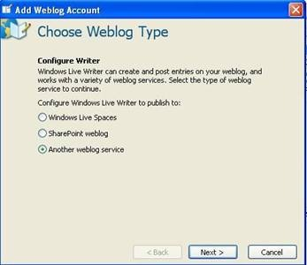
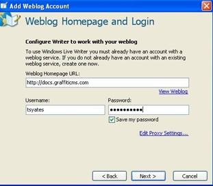
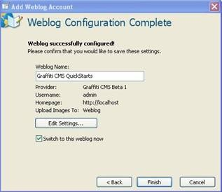

# Configuring Windows Live Writer with Graffiti
Configure Windows Live Writer. For additional information about how to use WLW with Graffiti, refer to [Windows Live Writer Application](Windows-Live-Writer-Application). If you have not installed Windows Live Writer (WLW), you can [download it from here](download it from here).

_**Procedure**_

1. Start WLW to initiate the WLW installation wizard. The welcome window displays. 

: 

2. Select the **I don’t have a weblog…** button.

3. Click **Next>**. The wizard will walk you through the process of setting up a weblog account. When you have finished setting up your account, the WLW application opens and the main page displays. 

: 

4. From the toolbar, select **Weblog>Add Weblog Account**. The Choose Weblog Type window displays. 

: 

5. Select the **Another weblog service** button.

6. Click **Next>**. The Weblog Homepage and Login window opens. 

: 

7. Enter your site information.

8. Click **Next>**. WLW configures itself. WLW may ask if you want to import your sites template. This is optional. The Weblog Configuration Complete window displays. 

: 

9. Click **Finish**.