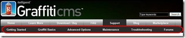
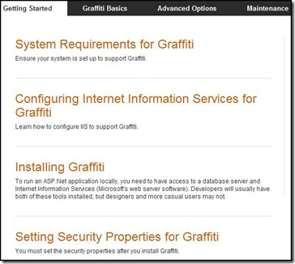
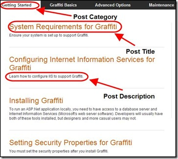
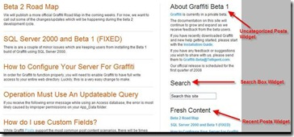
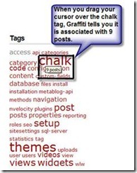
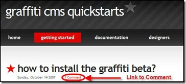
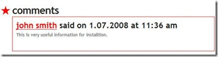

# Creating Content for Your Website
Graffiti supports multiple forms of content:
* Categories 
* Posts 
* Tags 
* Comments 

## Categories
A category is the main unit of organization for Graffiti. Every post must be added to exactly one category. The limitation of one enables Graffiti to build smart meaningful urls and avoid search engine optimization penalties associated with duplicate content. Graffiti also supports child categories. Each parent category can have its own set of child categories.

When you create a category, Graffiti posts the category label on your site’s home page if your [theme](Themes) supports this action.

: 

After you edit your navigation the first time, Graffiti will no longer display new categories to the website except through [navigation links](Dynamic-Navigation).

Although typically you will create posts after you create your categories, Graffiti gives you the flexibility of creating categories on the fly as you create your posts.

At the category level you can specify the category name, the names of any links to the category, category descriptive text, meta data, and so on.

When you click on a category label, Graffiti displays on the web page all posts assigned to the category. The example below shows the list of posts associated with the Getting Started category.

: 

[Click here](Creating-a-Category) to get started with creating a category.

## Posts
The main form of content in Graffiti is a post. In most cases, you will assign a post to a category. When you publish your post, the post title and brief post description display on the category page.

: 

While a post has just three required values (Category, Body, and Title) there are quite a few other values and tools you can use to enhance your content and your user’s experience. At the post level you can specify the post title, a description of the post content, tags, meta data, and so on. You can also add links to other files in the post body.

[Click here](Setting-Post-Content) to get started with creating a post.

## Tags
A tag is a keyword or term associated with a post. Tags give you flexibility in structuring your website. While Graffiti posts must exist in only a single category, you can relate a post to multiple categories by using tags. Tags are an optional [widget](Creating-a-Tag-Cloud).

The tag cloud displays in the left or right sidebar with links to all posts that have tags.

: 

Graffiti ranks tags by the number of posts with which the tags are associated so that the most used tags have the largest font size. In the tag cloud in the example above, chalk and themes are the tags associated with the greatest number of posts. When you drag your cursor over a link in the tag cloud, Graffiti tells you how many posts have the tag.

: 

## Comments
A comment is simply a user’s response to a post. Comments are a useful way of soliciting feedback from consumers.

: 

When you click on the comment link, Graffiti opens the post and displays the comment, along with the date and time the comment was published, at the bottom of the post.

: 

Graffiti allows you to specify that comments be enabled for a specific length of time and that they are checked for spam before they are published. If Graffiti thinks a comment is spam, it will notify you so you can approve the comment displaying it.

You also must ensure the post is enabled for comments. This must be done at either the site-wide level or at the post level. The post-level setting always overrides the site-wide default setting.

[Click here](Enabling-Comments) to get started with comments.
