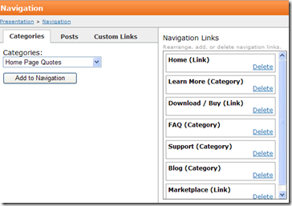
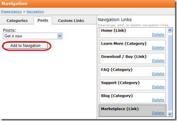
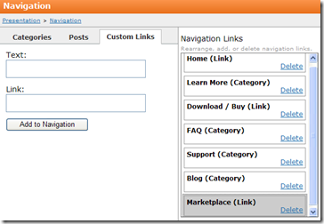

# Creating Navigation Links
Graffiti uses the Dynamic Navigation feature so you [can create links to categories and posts](Creating-Content-for-Your-Website).

By default, Graffiti creates navigation links for all of the top-level categories you create. However, you can also create links for all uncategorized posts as well as custom links to other pages in your site or to external sites.

_**Procedure**_

Because Graffiti initially creates links for your original categories, the following procedure shows how to create links for uncategorized posts and custom links.

## Posts
1. Navigate to Control Panel > Presentation > Navigation. The Navigation page displays. 

: 

Note that the categories already display in the list of navigation links.

2. Select the Posts tab. 

: 

3. Select your uncategorized post from the Posts drop-down list. 

4. Click Add to Navigation to move the post to the Navigation Links list. 
 
: 

_Graffiti automatically saves the change. When you refresh your web page, the new link will display._

## Custom Links
1. Navigate to Control Panel > Presentation > Navigation. The Navigation page displays. 

: 

Note that the categories already display in the list of navigation links.

2.Select the Custom Links tab. 

: 

3.Enter the name of the link and the link address. 

4.Click **Add to Navigation**. Your custom link is moved to the Navigation Links list. Graffiti automatically saves the change. When you refresh your web page, the new link will display.