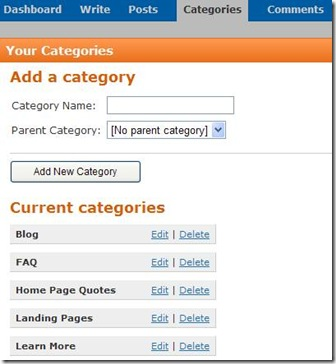

# Creating a Category
This procedure describes how you can create a [category](Creating-Content-for-Your-Website) before you assign a post to it as well as how you can create a category as you create a post.

_**Procedure**_

## Creating Categories
The following procedure explains how to create a category so you can later assign posts to it.

1. Navigate to Control Panel > Categories to display the Your Categories page. All existing categories display on the Your Categories page.

: 

2. Enter the category name. Graffiti defaults the Parent Category setting to No parent category. However, you can assign the new category as a child category by selecting an existing category from the drop-down list. 
Click [here](Category-Properties) for a complete list of category properties.

3. Click **Add New Category**. 

## Creating a Category with a Post
The following procedure explains how to create a category at the same time you create a post.

1. Create a [post](Creating-Content-for-Your-Website). 

2. In the **Category** field, select Add New Category. The **Add New Category** data field displays to the right of the **Category** field. 
 
: 

3. Type the category name in the data field. 

4. Click **Add New Category**. Graffiti inserts the newly created category in the **Category** field. 