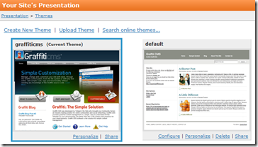
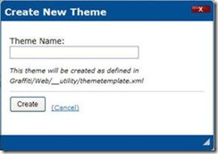

# Creating a New Theme
Graffiti allows you to create a new theme with a few simple steps.

_**Procedure**_

1. Navigate to Control Panel > Presentation > Themes. The Your Site’s Presentation page displays. 

: 

2. Click Create New Theme in the upper-left corner of the page. The Create New Theme pop-up box displays. 
 
: 

3. Type the name of the theme in the text field. 

4. Click **Create**. The new theme displays in the catalog on the Your Site’s Presentation page.