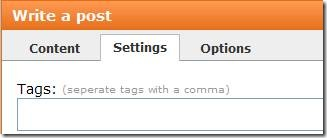
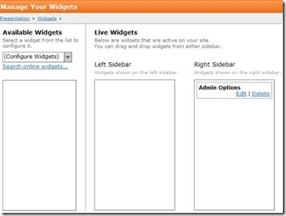
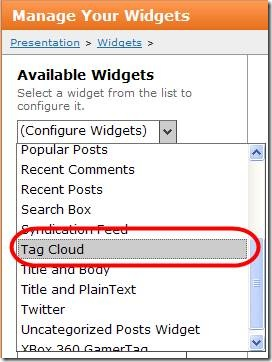
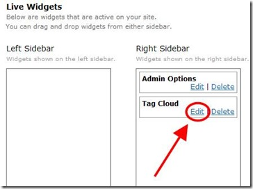
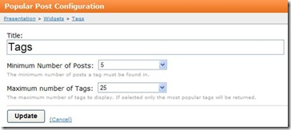

# Creating a Tag Cloud
Add tags to a post on the Settings tab. You can add tags when you create the post or add them later by editing the post. 

: 

Use the following procedure to create a tag cloud widget. 

_**Procedure **_

1. Navigate to Control Panel > Presentation > Widgets. The Manage Your Widgets page displays. 

: 

2. Select Tag Cloud from the drop-down list in the Available Widgets panel. 

: 

3. Drag Tag Cloud to the desired side bar panel. 

After you create your tag cloud, you can specify two additional settings: the minimum number of posts the tag must be associated with to display in the tag cloud; and the maximum number of tags that will be displayed in the tag cloud.

4. Click Edit. 

: 

_The Popular Post Configuration page displays._

: 

5. Specify your minimum and maximum settings. 

6. Click **Update**. When you refresh your Web site, the tag cloud displays in the side bar you specified.
