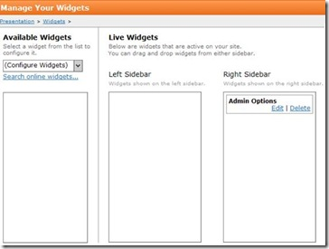
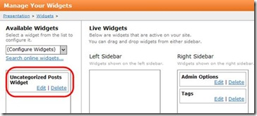
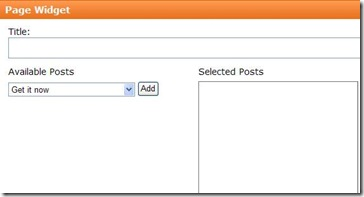

# Creating an Uncategorized Post Widget

The Uncategorized Posts widget allows you to add any of your uncategorized posts to the sidebar. You can use [uncategorized posts](uncategorized-posts) as another way of managing content on your Web site. 

When you create an uncategorized post, you are not assigning it to any of your existing categories. Instead, you generally use it as a widget which you can add to your theme. 

_**Procedure **_

1. Navigate to Control Panel > Presentation > Widgets. The Manage Your Widgets page displays. 

: 

2. Select Uncategorized Posts from the Available Widgets drop-down list. Uncategorized Posts displays in the panel below the drop-down list. 

: 

3. Click **Edit**. The Page Widget page displays. 

: 

Your list of uncategorized posts is contained in the Available Posts drop-down list.

4. Select the post you want to display in the sidebar. 

5. Click **Add**. 

Repeat Steps 4 and 5 until you have selected all the posts you want to display. 

6. Click **Update**. The Manage Your Widgets page displays. 

7. Drag the widget to the desired sidebar panel. When you refresh your Web site, the uncategorized posts widget displays in the sidebar you specified. 