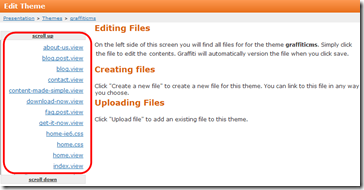
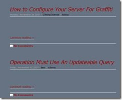
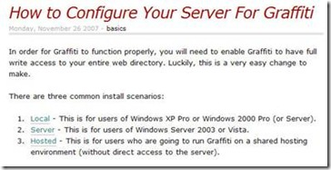
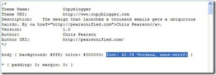
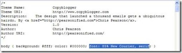
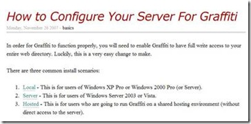
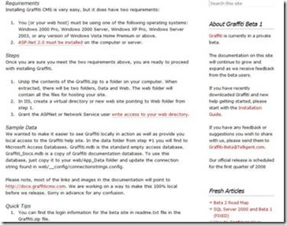
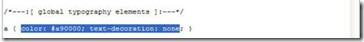
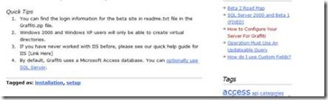

# Customizing the style.CSS File
You can customize your site by modifying the settings in your theme's style.CSS file.

Graffiti is designed to fit the needs of a wide range of users, from experienced web developers and designers to desktop users who have little or no experience in Web site design and development. The tools Graffiti provides reflect that wide range of user. Users with little or no experience in designing and developing a Web site will find some Graffiti tools more complex and it will require some effort on their part to understand how to work with style sheets.

One of the more complex tools in Graffiti is [themes](Themes). At the most basic level, Graffiti’s design enables all users to [assign a theme](Assigning-a-Theme) to their Web site by doing nothing more than deciding on a theme and clicking on it with their mouse. Graffiti provides a small catalog of themes from which users can choose a theme, and we have plans to continue enlarging the theme catalog.

Experienced developers and designers will know how to work with themes. But as less experienced users develop their sites, they will want to have more and more control over the appearance of sites, things like background color, headings, and container size. Graffiti encourages these less experienced users to experiment with these kinds of attributes so they can become confident in using Graffiti to design their Web sites. However, we also urge caution and recommend that inexperienced users follow the suggestions provided below as they work with themes.

## Working with the style.CSS File
When you open a theme, you will see that it is comprised of several files, some of which are required by Graffiti, and others which are optional. These files include cascading style sheets (CSS) and [view files](view-files).

: 

All of these files are accessible, but Graffiti recommends that you be cautious in editing any of them. In fact, Graffiti recommends that you not edit the ie6.css and ie7.css files for any reason.

The style.css file contains such attributes as your Web site’s heading styles, widget text style and color, and container size. By working with these attributes you can get an idea of how HTML styles work and at the same time make some very basic decisions about the appearance of your web pages.

_**Procedure**_

1. Navigate to Control Panel > Presentation > Themes. The Your Site’s Presentation page displays. 

: 

This page contains the default theme and a short catalog from which you can choose a theme for your Web site.

However, you are going to create a test theme so you can experiment with making some very basic changes to your Web site’s appearance without compromising the code of the existing themes.

2. Click Create New Theme in the top-left corner of the page. **This is a critical step**. To ensure that you do not compromise any existing themes, you need to create a test theme on which you can learn and experiment. 

: 

Graffiti displays a Create New Theme modal window.

: 

3. Enter a name for your theme in the text box. For purposes of this procedure. 

4. Click **Create**. The Edit Theme page displays with the list of files associated with it. 

: 

Note that the navigation path indicates that you are editing the Test theme.

The appearance of the theme will be similar to your existing Web site’s theme. If your database is empty, Graffiti will duplicate the Default theme.

At this point you can continue from the Edit Theme page to edit the style.css file, but we are going to return for a moment to show you that the theme is now available on the Your Site’s Presentation page.

: 

To return to the Edit Theme page, click the _Personalize_ link.

: 

Now you are ready to edit your style.css file.

5. Click style.css on the Edit Theme page. The style.css source code displays. 

: 

Note the revision box in the top-right corner of the page. Every time you save the file, Graffiti creates an incremental version of the file. In our Test theme, we are on Revision 25, which indicates someone has already made a lot of modifications to this file. Click here for more information about Graffiti file versioning.

6. Modify your theme attributes. 

_The attributes we will discuss below are not an exhaustive list of attributes associated with the style.css file, but by showing how you can change some of the attributes, you will become more comfortable with changing other attributes in the file._

**Page Background Color**

_Here is the background color attribute:_

: 

_The World Wide Web (W3) Consortium has developed standards for web development, which includes color codes. You can easily access these codes from the internet. [Here is one such site](http://www.computerhope.com/htmcolor.htm#03)._

_Your Test theme default color is white (#fff). You will change it to slate gray, the standard color code of which is #657383._

: 

_You can save your changes after each modification so you can take a look at your web pages to assess how they look, or you can make all of your changes and then save them. For purposes of this exercise, however, you will save each modification and look at how your web page changes._

_Click the **Save Changes** button and another browser. You will need to refresh your web page after each modification to see the change. Note that the background color is now slate gray._

: 

**Body Text Style**

_Unfortunately, your body text becomes transparent with slate gray, so you will reapply your default background color so you can view the body text. Here is what your current body text looks like:_

: 

_Here is the body text attribute in our style.css file:_

: 

_The WW3 also has a list of standards for font, text, margin, table, and every other conceivable element you will use in creating your Web site. [You can access these standards from here](http://www.pageresource.com/dhtml/cssprops.htm)._

_We will change our font size and style, as well as add serifs._

: 

_After saving our modifications, refresh your browser to see how the text has changed on your web page._

: 

**Links Style and Appearance**

_You have a number of links on your web page indicated by the red text below._

: 

_Links are associated with your web page’s global typography elements. Here are the links attributes:_

: 

_You want our links to be royal blue (#2B60DE) and underlined. After you save your changes and refresh your browser note how the appearance of your links has changed:_

: 

_You will note that one link is red. That is because it has been visited (clicked on). All visited links become red. The visited attribute is also one that you can modify._

**Heading Format**

_Headings are associated with your web page’s core layout elements. Here are the heading format attributes:_

: 

_Your style sheet supports 4 levels of heading. Here is what the headings look like on your web page:_

: 

_You will remove the italics and change the color._

: 

_Here is what your page looks like after you apply the changes._

: 